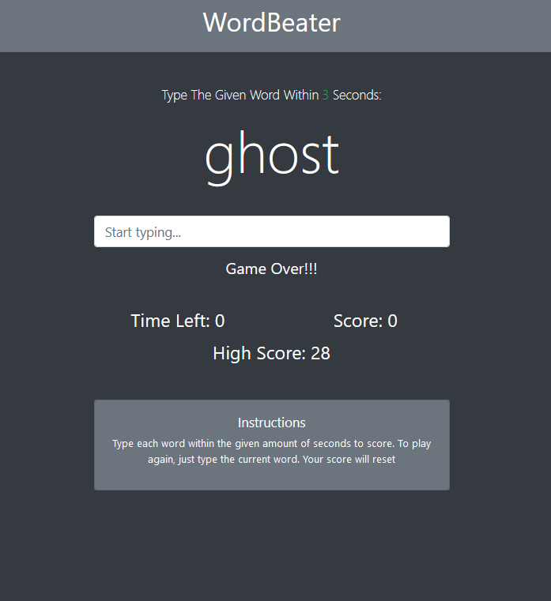

# WordBeater

WordBeater is a fun and challenging web-based word typing game. Test your typing speed and accuracy by typing the given words within a specified time limit.

## Table of Contents

- [Introduction](#introduction)
- [Features](#features)
- [How to Play](#how-to-play)
- [Installation](#installation)
- [Built With](#built-with)
- [License](#license)
- [Acknowledgements](#acknowledgements)

## Introduction

WordBeater is a word typing game designed to entertain and improve your typing skills. It offers different levels of difficulty, ranging from easy to hard. The game displays a random word, and you have to type it correctly within the given time to score points. Keep typing and challenging yourself to beat your own high score!

## Features

- Multiple Difficulty Levels: WordBeater offers three difficulty levels - easy, medium, and hard, to accommodate players of different skill levels.
- Real-Time Feedback: Receive instant feedback on whether you typed the word correctly or not.
- High Score Tracking: The game keeps track of your high score using Local Storage, so you can challenge yourself to beat your best score.
- Interactive UI: A user-friendly interface with a timer, score display, and clear instructions makes the game engaging and easy to understand.

## How to Play

1. Visit the WordBeater website.
2. Select your desired difficulty level: easy, medium, or hard.
3. The game will start, and you will see a word displayed on the screen.
4. Type the word correctly in the input field within the given time limit.
5. If the word matches, you will score a point, and a new word will appear.
6. Continue typing words until the time runs out.
7. Your final score will be displayed, and you can try to beat your high score.

## Installation

There is no installation required to play WordBeater. Simply visit the website and start playing!

## Built With

- HTML
- Bootstrap
- JavaScript

## License

This project is licensed under the [MIT License](LICENSE).

## Acknowledgements

- Special thanks to the Brad Travesy Udemy courses and Youtube channel.

## GitHub

<a href="https://github.com/blockchaincyberpunk1"><strong>blockchaincyberpunk1</a></strong>

Visit my website: <strong><a href="http://blockchaincyberpunk1.github.io/thepolyglot">The Polyglot</a></strong>

## Contact

Feel free to reach out to me on my email:
thepolyglot8@gmail.com